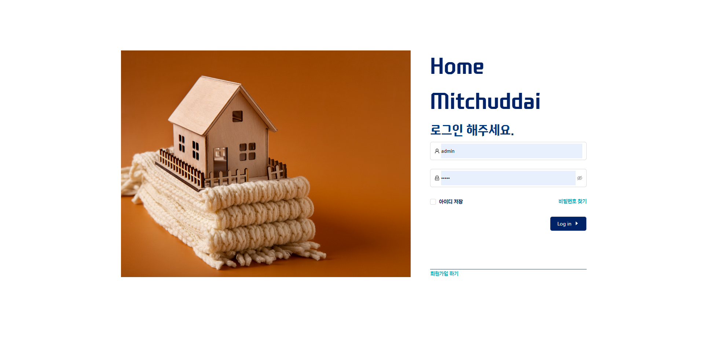
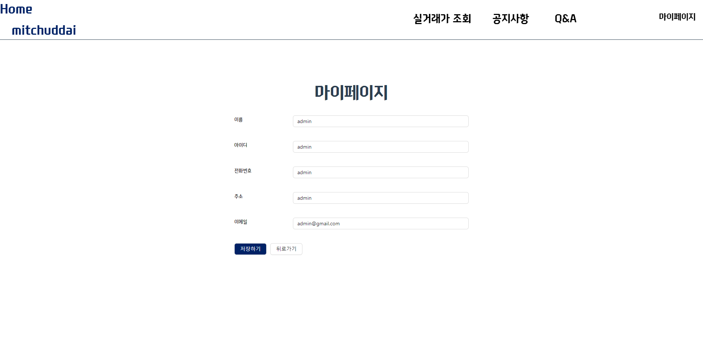
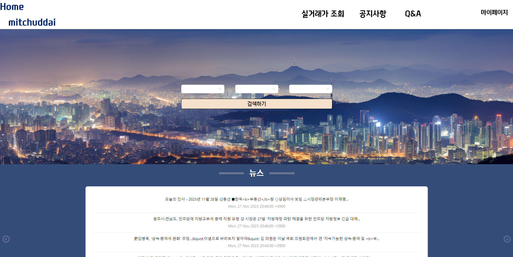
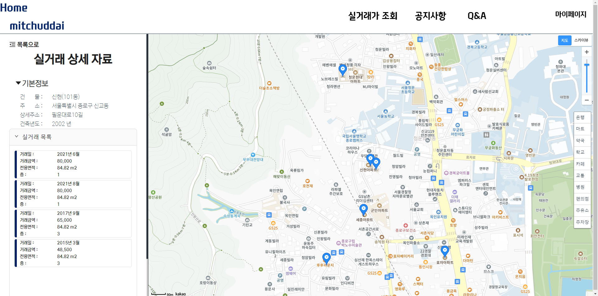

# Where is my home

> `Samsung Software Academy For Youth` 
> 10기 1학기 최종 프로젝트  > **Where is my home - home mitchuddai** 입니다.

 

## 팀 소개

|                              <a href="https://github.com/Yg-Hong">홍윤기 (팀장)</a>                               |                                 <a href="https://github.com/lucaschoi99">최민수 </a>                                 |
| :---------------------------------------------------------------------------------------------------------------: | :------------------------------------------------------------------------------------------------------------------: |
|  |  |

 

## 기획 의도

부동산 매매에 대한 여려운 현재. 당신의 매매 기준이 주변 인프라라면?  
내 집 마련이 어려운 현실에서 `home mitchuddai`는 전국 모든 지역의 아파트 매매 정보를 주변 인프라 정보와 함께 제공하여 이용자가 원하는 정보를 확인할 수 있도록 합니다.

 

## 기술 스택

<!-- 

    

 -->

---

# 구현 기능

### 기능 1

- 공공데이터 + KaKao Map API를 활용한 아파트 정보 조회 시스템

### 기능 2

- 네이버 뉴스 api, 유튜브를 통해 부동산 관련 정보 제공 시스템

### 기능 3

- 움직인 지도상 좌표를 기준으로 새롭게 건물 리스트 갱신

<!-- ### 기능 4

- Haversine Formula(구의 최단거리 알고리즘)을 활용한 아파트 주변 편의시설 정보 제공 -->

---

# API 문서 - swagger 사용

    

# 화면 디자인

## 로그인 & 회원 가입

|              로그인              |                  회원가입                  |            마이페이지             |
| :------------------------------: | :----------------------------------------: | :-------------------------------: |
|  |  |  |

 

## 메인 페이지

| 메인 페이지  
| :-----------------------------------------------------------------------------------------------------------: |
|  |

## 메인 하단 컨텐츠

|                    뉴스                     |                      유튜브                      |                    공지사항                    |
| :-----------------------------------------: | :----------------------------------------------: | :--------------------------------------------: |
|  |  |  |

 

## 건물 정보 리스트

|  지역 기반 검색 건물 정보(서울시 은평구 수색동)   |           좌표 기반 검색 건물 정보            |
| :-----------------------------------------------: | :-------------------------------------------: |
|  |  |

 

## 건물 상세 정보

|             건물 상세 정보              |         근처 편의 시설 마커          |          편의 시설 도보 거리           |
| :-------------------------------------: | :----------------------------------: | :------------------------------------: |
|  |  |  |

 

## 공지사항 & QnA 게시판

|             공지사항 게시판              |             QnA 게시판              |
| :--------------------------------------: | :---------------------------------: |
|  |  |

 

## 공지사항 & QnA 게시판

|             공지사항 게시판              |             QnA 게시판              |
| :--------------------------------------: | :---------------------------------: |
|  |  |

 

## ERD

    

---

## 클래스 다이어 그램

 

    

 

---

 

## 주요 기능

### 아파트 검색

> 페이지 내에서 아파트를 검색할 수 있습니다.

- 홈/검색 페이지에서 아파트를 검색할 수 있습니다.
- 지역(동) 이름/지도 상 좌표 두가지 기준으로 검색을 수행합니다.

### 아파트 매매 내역 조회

> 검색한 아파트의 매매내역을 확인할 수 있습니다.

- 매매 내역은 최신순으로 정렬되어 있습니다.

### 건물에 대한 댓글 기능

> 사용자가 직접 해당 아파트에 대한 댓글을 남길 수 있습니다.

- 다른사람이 작성한 리뷰를 조회할 수 있습니다.
- 다른사람이 작성한 리뷰에 좋아요를 누를 수 있습니다.
- 자신이 작성한 리뷰에 대해서 수정/삭제를 수행할 수 있습니다.

### 뉴스, 영상을 이용한 부동산 정보 제공

> 메인 화면을 통해서 최신 부동산 뉴스, 영상 정보에 대해 접근할 수 있습니다.

 
